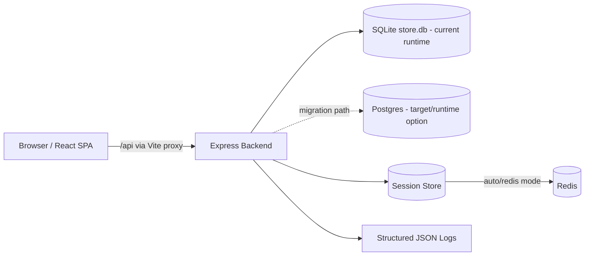

# Architecture Reference

This document is the technical reference for the `agents_testing` repository
and the demo web application.
It describes the current system shape, key responsibilities, and the
engineering workflow around implementation and verification.

## 1) System Overview

The application is a full-stack web store with:

- `app/frontend`: React + Vite single-page app
- `app/backend`: Express API with SQLite runtime persistence and Postgres
  migration support assets
- `cypress/`: E2E and accessibility suites
- `requirements/`: requirement artifacts used by agent-driven workflows

The system supports:

- authentication and registration
- role-based authorization (`admin`, `manager`, `editor`, `user`)
- catalog browse/search/detail
- cart and checkout
- order listing, details, and cancellation
- admin user management

## 2) High-Level Architecture

## 3) Frontend Architecture (`app/frontend`)

Core runtime:

- Vite dev server with `/api` proxy to backend
- React Router for route-driven UI
- Material UI theme layer
- localStorage for auth token and user profile snapshot

Main composition:

- `src/App.jsx` owns session, routing, major state, and API calls
- page-level components under `src/components/`
- search and pagination state synchronized through URL query params

Important routes:

- `/` login
- `/register`
- `/store`, `/store/item/:itemId`
- `/store/product/new`, `/store/product/:itemId/edit`
- `/checkout`
- `/orders`, `/orders/:orderId`
- `/admin/users`, `/admin/users/:userId/edit`
- `/help`

## 4) Backend Architecture (`app/backend`)

Core runtime:

- Express API (`src/server.js`)
- input normalization and validation at route boundaries
- bearer-token auth backed by pluggable session store
- role gates for admin and catalog-write endpoints
- scoped fixed-window rate limiting for auth/checkout paths
- structured logging with correlation IDs and sensitive-field redaction

Primary middleware order:

1. `cors`
2. `express.json`
3. `correlationIdMiddleware`
4. `requestLoggingMiddleware`
5. route handlers and auth/role middleware

Key API groups:

- Auth: `/api/login`, `/api/register`, `/api/logout`
- Admin: `/api/admin/roles`, `/api/admin/users`, `/api/admin/users/:id`
- Catalog: `/api/catalog`, `/api/catalog/:id` (+ create/update)
- Checkout: `/api/checkout`
- Orders: `/api/orders`, `/api/orders/:orderId`, `/api/orders/:orderId/status`
- Utility: `/health`, `/api/help`

## 5) Data Architecture (SQLite + Postgres Path)

Current runtime data store is SQLite, initialized and migrated in `src/db.js`.

Main tables:

- `users`
- `role_types`
- `catalog_items`
- `orders`
- `order_items`
- `order_status_types`

Characteristics:

- schema bootstrap + additive migration behavior at startup
- seeded demo users and catalog items when empty
- role and order-status lookup tables normalized
- indexes for common user/order/catalog access paths

Postgres status and reference points:

- Postgres infrastructure is available via `docker-compose.yml` (`postgres`
  service).
- Migration rehearsal and parity tooling exists under
  `app/backend/scripts/migrations/`.
- Root scripts are available for migration workflows:
  - `npm run db:pg:schema`
  - `npm run db:pg:rehearse`
  - `npm run db:pg:parity`
  - `npm run db:pg:benchmark`
  - `npm run db:pg:spike`
- Migration strategy/details are documented in
  `app/backend/docs/postgres-migration-plan.md`.

Interpretation for contributors:

- **Today:** application API runtime persists to SQLite by default.
- **Migration path:** Postgres is implemented as an infra dependency plus
  migration validation toolchain, ready for staged adoption.

## 6) Session Architecture

`src/session-store.js` supports:

- `memory` mode (in-process map with TTL)
- `redis` mode
- `auto` mode (tries Redis when configured, falls back to memory)

Relevant environment knobs:

- `SESSION_STORE_DRIVER`
- `REDIS_URL`
- `REDIS_REQUIRED`
- `SESSION_TTL_SECONDS`
- `SESSION_KEY_PREFIX`

## 7) Infrastructure and Deployment

Two primary local execution models:

1. Workspace dev scripts (`npm run dev`, backend + frontend processes)
2. Docker Compose:
   - infra services: Postgres + Redis
   - app profile: frontend + backend containers with health checks

Compose services are defined in `docker-compose.yml`.

## 8) Testing and Quality Gates

Testing stack:

- Cypress E2E suites (`cypress/e2e`)
- Cypress accessibility suite (`cypress/e2e/accessibility.cy.ts`)
- backend rate-limit tests

Workflow gate:

- `npm run workflow:final-pass`
  - runs `test:e2e` and `test:a11y`
  - validates required sections in the active requirements artifact:
    - `## What Changed`
    - `## Verification Results`
    - `## Review Results`

## 9) Agent-Guided Delivery Architecture

Repository-level governance is documented in:

- `AGENTS.md` (baseline rules)
- `AGENT-CLARIFICATION.md`
- `AGENT-ANALYSIS.md`
- `AGENT-CYRPRESS.md`
- `AGENT-REVIEW.md`

Process expectations:

- implementation is gated by analysis + explicit user approval
- ad hoc requests require explicit user choice (abort vs proceed)
- when proceeding ad hoc without a ticket, create
  `requirements/adhoc-<N>.md` and use it as active artifact

## 10) Extension Guidance

When adding new capabilities:

- keep route and UI concerns separated
- enforce validation at API boundaries
- reuse role-gate patterns for authorization
- update Cypress coverage and relevant `specs/*.feature`
- keep requirements artifact updates in sync with delivered behavior
